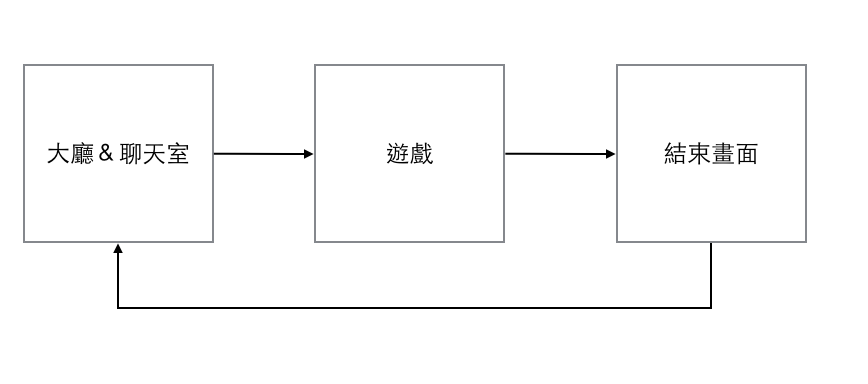

## Project

Game Flow

*  大廳＆聊天室
	0. 輸入名字
	1. 進入大廳聊天
	2. 可選擇純聊天or聊天兼等待遊戲開始
	3. player 1 決定遊戲開始後，全部進入遊戲畫面

		Q. 遊戲開始後進入的人怎麼辦

* 遊戲

	* 遊戲主畫面
		0. 倒數後開始
		1. 開始位置：random
		2. 人物：不同顏色三角形，可攻擊，被擊中則死亡
		3. 遊戲結束條件：場上只剩下一個人

		Q. 互相攻擊

		Q. 死亡效果

	* 玩家列表
		1. 顯示玩家名字、顏色、狀態

	* 聊天室
		1. 所有人（包含未參與遊戲者）都可以繼續聊天

* 結束畫面
	1. 踩在腳下
	2. 點擊按鈕自行返回大廳

## Job Assign

* 畫面（html, css）- Yvonne
* Front-end 
	* chat room - Charles
	* game - David
	* result - Yuyu
* Back-end
	* chat room - Tang
	* game - Eddie
	* result - Jane

## 下次開會：6/12

1. 前置作業：repository建好：done, [https://github.com/baulab/OnigiriBattle](https://github.com/baulab/OnigiriBattle)
2. 更新近況
3. 訂出接下來進度
